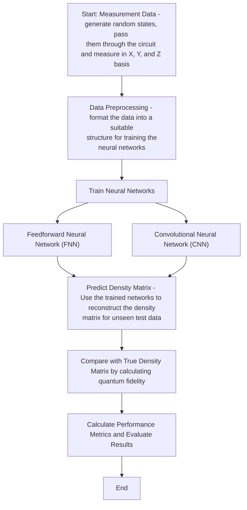

# Basic Quantum State Tomography with AI

This repository contains a basic implementation for **Quantum State Tomography** for a single, two, and three qubit quantum circuit
using simple **feedforward neural networks** and **convolutional neural networks**.
The neural networks and training are done using **PyTorch** and the quantum circuits are generated and simulated using **Qiskit**.

## Table of Contents
- [Overview](#overview)
- [Features](#features)
- [Getting Started](#getting-started)
  - [Knowledge Prerequisites](#knowledge-prerequisites)
  - [Installation](#installation)
  - [Repository Structure](#repository-structure)
- [Usage](#usage)
   - [The training pipeline](#the-training-pipeline)
   - [Generating data](#generating-data)
   - [Training and evaluation](#training-and-evaluation)
- [Interesting points](#interesting-points)

## Overview
**Quantum state tomography** (QST) is the process of reconstructing the density matrix of a quantum system (for example, a quantum circuit) using measurement data obtained in different bases. This project shows how QST can be performed using **feedforward neural networks** (FNNs) and **convolutional neural networks** (CNNs).

This repository was created as part of a university course project at the Ss. Cyril and Methodius University in Skopje and provides a simple and intuitive implementation of QST for **1-qubit**, **2-qubit**, and **3-qubit systems**. While most of what is done here is rather trivial in terms of both QST and deep learning, this repository is designed to serve as a well-packaged example for anyone interested in exploring how neural networks can be applied to QST without requiring deep expertise in quantum mechanics, quantum circuits, or artificial intelligence.

The goal is to make QST accessible and comprehensible through **straightforward code and examples**, focusing on delivering the basic idea in a relatively clean and minimalistic manner. Whether you're a beginner curious about QST or an enthusiast looking to experiment with neural networks in quantum computing, this project offers an easy to understand and easily expandable starting point upon which more complex work can be done.

## Features
- Data generation for QST using deep learning
- QST using a FNN for a single qubit (most trivial example)
- QST using a FNN for a two qubit circuit - the Bell state
- QST using a CNN for a two qubit circuit - the Bell state
- QST using a FNN for an arbitrary three qubit circuit
- QST using a CNN for an arbitrary three qubit circuit

## Getting Started
### Knowledge Prerequisites
This project assumes a basic understanding of the following:
- deep learning (specifically FNNs, CNNs, and the gradient descent training process) within PyTorch
- QST and its purpose
- Defining quantum circuits within Qiskit
- Measuring quantum circuits in different bases

### Installation
1. **Clone the repository**:
   ```bash
   git clone https://github.com/VladimirK909/basic-quantum-state-tomography-with-ai.git
   cd basic-quantum-state-tomography-with-ai
   ```
2. **Install the required dependencies**:
Run the following command:
   ```bash
   pip install -r requirements.txt
   ```
   Alternatively, you can manually install the following packages (everything else should come pre-installed by default with Python):
   - **numpy** version 1.26.4
   - **scipy** version 1.13.1
   - **pytorch** version 2.3.1
   - **qiskit** version 0.46.0 
### Repository Structure
```
.
├── data and labels      # .csv files used for the training
├── data generation      # Jupyter notebooks for generating .csv data files
├── 3_qubits             # Neural network training for a 3 qubit circuit
├── 2_qubit_bell_state   # Neural network training for the 2 qubit Bell state circuit
├── single_qubit.ipynb   # Trivial tomography for one qubit, data generation included
├── circuit_tester.ipynb # Used for visualizing the three quantum circuits
├── requirements.txt     # Python dependencies
└── README.md            # Project documentation
```

## Usage

### The training pipeline
Firstly, we need to establish the training pipeline that will be used for performing QST on the quantum circuits, which is given on the following flowchart:

In the end, we are left with a neural network that is able to accurately reconstruct the density matrix of a quantum circuit from measurement data, providing a simple yet effective demonstration of how deep learning techniques can be utilized to perform QST.

The quantum circuits are simulated for the purposes of this project, but in the real world the measurments would be performed using a real quantum computer by preparing a lot of randomized input states for the circuit and measuring them in the three bases of the Hilbert space.

### Generating the data
For the single qubit trivial example, the whole pipeline is contained within the `single_qubit.ipynb` notebook. For the other two circuits, generating a preprocessing the data is done separately through the notebooks in the `data generation` folder. Changing `num_samples`
will change the number of individual data points in the dataset, i.e. the number of random statevectors ran through the circuits. In the end, we are left with one .csv file for the training dataset (usually denoted as **X**), and one .csv files for the labels (usually denoted as **Y**).
### Training and evaluation
In the `3_qubits` and `2_qubit_Bell_state` folders you can find the notebooks where the neural networks are trained and evaluated.

Firstly the `FidelityLoss` function is defined which is used as the loss function for the neural networks (*more on this in the [next section](#interesting-points)*) . Afterwards, the neural network itself is defined as a FNN or a CNN along with the training parameters (learning rate, batch size, etc,).

Now we are ready to train and evaluate. After training for a specified number of epochs, we use the `avrg_fidelity(n)` function to evaluate the resultant neural network. This function generates unseen measurment, predicts the density matrix through the neural network and calculates the quantum fidelity between the predicted and real density matrix. Quantum fidelity is a metric which calculates how 'close' to density matrices are. It expresses the probability that one state $\rho$ is able to pass a test to identify as another state $\sigma$, and is defined as:
$$ F(\rho,\sigma) = \left( \text{tr} \sqrt{\sqrt{\rho} \sigma \sqrt{\rho}} \right)^2 $$

This is done `n` times, after which the function calculates the average of all the `n` fidelities, which we can use as a simple yet fairly indicative metric for whether the network was trained properly.

## Interesting points - the loss function
 What is interesting to note is how the loss function is chosen and defined in this project. Initially, I tried using more 'traditional' loss functions used elsewhere in deep learning, such as MSE or MAE. However, the results were not that good regardless of whether I changed the network architectures or added more training data.

What I soon realized is that we are using quantum fidelity as the evaluation metric, and metrics like MSE or MAE are too 'different' from quantum fidelity in terms of what they are actually calculating, therefore making the gradient descent relatively poor.

The next logical step was to try using quantum fidelity as the loss function, given by:
$$ F(\rho,\sigma) = \left( \text{tr} \sqrt{\sqrt{\rho} \sigma \sqrt{\rho}} \right)^2 $$

where $\rho$ and $\sigma$ are the density matrices which fidelity is being calculated. The problem with using this as a loss function is that the function contains a square root of a matrix, which is not necessarily differentiable and therefore cannot be implemented within PyTorch.

In order to deal with this, we define the loss function as the following: 
$$ L(\rho,\sigma)=\|(\rho-\sigma)\|_F$$

which is the **Frobenius Norm** of the difference between the two matrices. The Frobenius Norm is a measure of the "size" or "magnitude" of a matrix, and is calculated by the square root of the sum of the absolute squares of its elements:
$$\|A\|_F = \sqrt{\sum_{i=1}^{m} \sum_{j=1}^{n} |A_{ij}|^2}
$$

Hence, a greater loss would mean a greater Frobenius norm for the difference between the two matrices, meaning that they are more different. This is not the same as quantum fidelity, but it is more analogous than using other more traditional metrics, thereby making effective enough as a loss function for this project.
